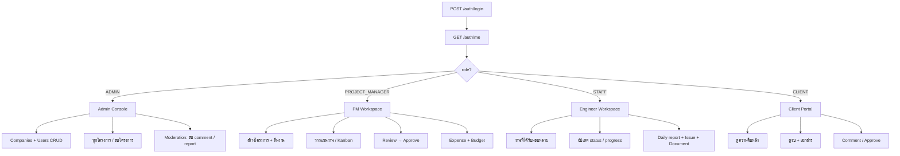
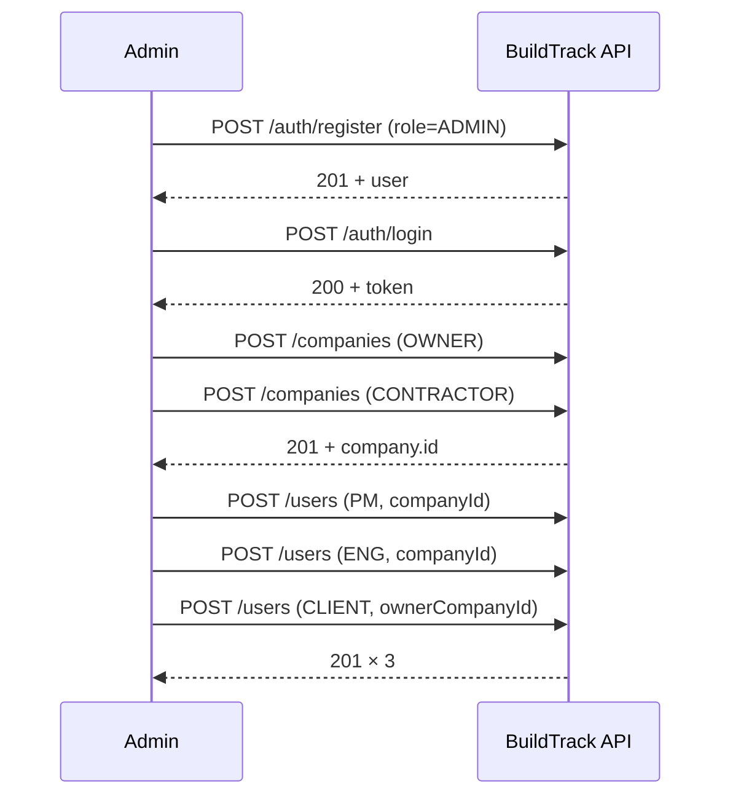
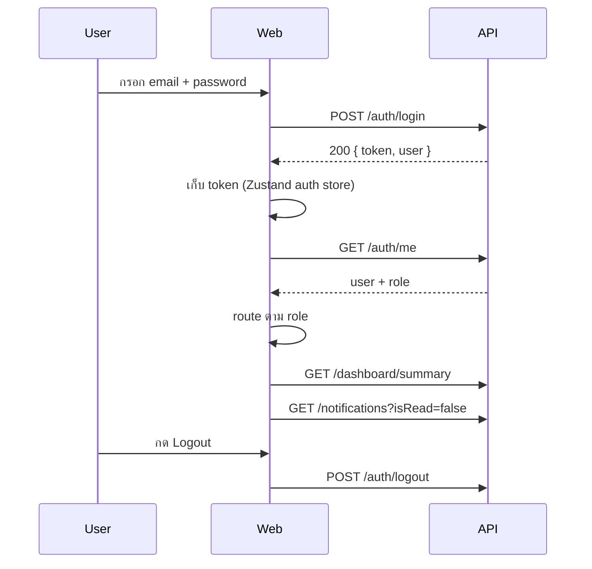
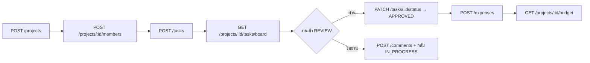
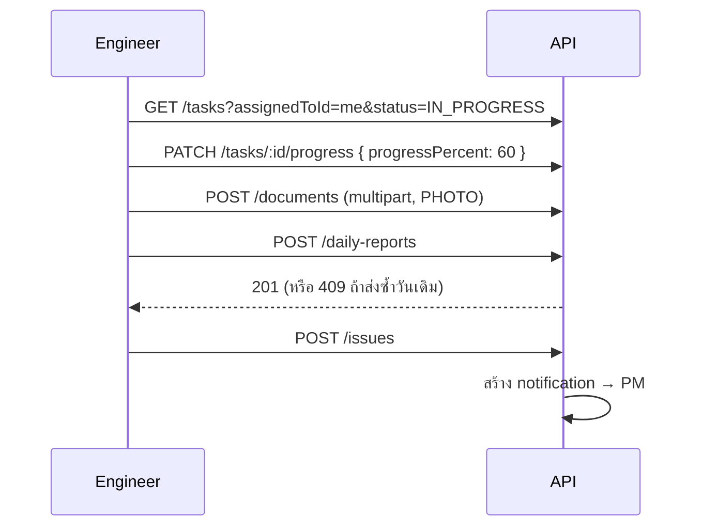
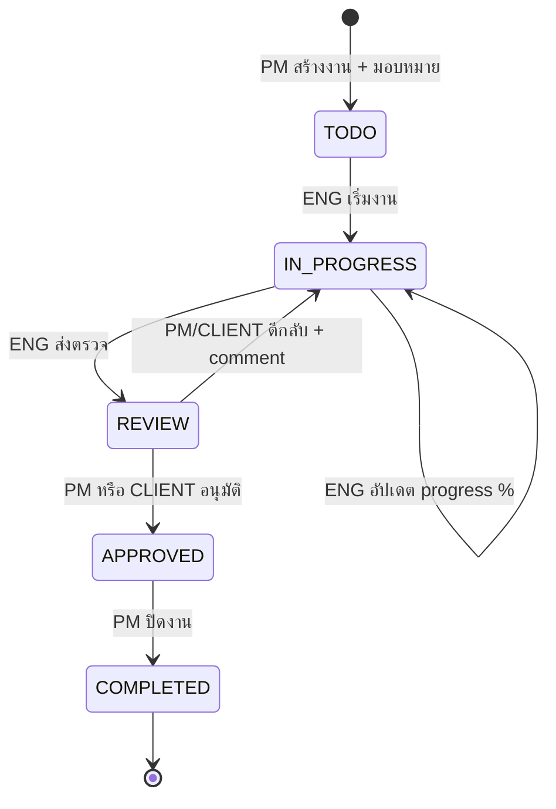

# 🔄 BuildTrack — User & Admin Workflows

เอกสารนี้แปลง endpoint ใน [APIs.md](APIs.md) ให้เป็น **ลำดับการใช้งานจริง** (screen → API call → ผลลัพธ์)
ใช้เป็น checklist ตอนสร้าง frontend และตอนเขียน integration test

**Base URL:** `http://localhost:8000/api/v1`
**Roles:** `ADMIN` · `PROJECT_MANAGER` (PM) · `STAFF` (ENG) · `CLIENT`

> สัญลักษณ์ในตาราง: 🔒 = ต้องมี `Authorization: Bearer <token>` · ⛔ = จุดที่ backend ต้อง block (ไม่ใช่แค่ซ่อนปุ่ม)

---

## 0. Workflow Map (ภาพรวม)



---

# 🅰️ ส่วนที่ 1 — ADMIN Workflows

ADMIN คือ role เดียวที่จัดการ "ข้อมูลตั้งต้น" ของระบบ (บริษัท + ผู้ใช้) และเป็น role เดียวที่ **ลบโครงการ** ได้

---

## A-0. Bootstrap ระบบครั้งแรก (Day 1)

ลำดับนี้สำคัญ — สร้างผิดลำดับจะติด FK เพราะ `user.companyId` และ `project.clientCompanyId` อ้างถึง `company`



| # | ขั้นตอน | Method | Endpoint | Body / Note |
| - | ------- | ------ | -------- | ----------- |
| 1 | สร้าง admin คนแรก | POST | `/auth/register` | `role: "ADMIN"` — หลัง seed แล้วควรปิดการ register เป็น ADMIN จาก public |
| 2 | เข้าสู่ระบบ | POST | `/auth/login` | เก็บ `token` ไว้ใน store |
| 3 | สร้างบริษัทเจ้าของโครงการ | POST 🔒 | `/companies` | `type: "OWNER"` |
| 4 | สร้างบริษัทผู้รับเหมา | POST 🔒 | `/companies` | `type: "CONTRACTOR"` |
| 5 | สร้างผู้ใช้ทีละ role | POST 🔒 | `/users` | ผูก `companyId` ที่ได้จากขั้น 3–4 |
| 6 | ตรวจผลลัพธ์ | GET 🔒 | `/users?page=1&limit=20` | ควรเห็นครบทุกคน |

> ⚠️ **ข้อควรระวัง:** `POST /auth/register` เป็น public — ถ้าปล่อยให้ส่ง `role` ได้อิสระ ใครก็สมัครเป็น ADMIN ได้
> ทางแก้: บังคับ `role` เป็น `STAFF` ที่ฝั่ง service สำหรับ public register แล้วให้ ADMIN เปลี่ยน role ผ่าน `PATCH /users/:id` แทน

---

## A-1. จัดการผู้ใช้ (User Lifecycle)

| ขั้นตอน | Method | Endpoint | Role | Response |
| ------- | ------ | -------- | ---- | -------- |
| เปิดหน้า Users | GET 🔒 | `/users?page=1&limit=20&sort=-createdAt&q=` | ADMIN | list + pagination |
| ค้นหาพนักงาน | GET 🔒 | `/users?q=purachaet` | ADMIN | filtered list |
| เปิดดูรายคน | GET 🔒 | `/users/:id` | ADMIN, PM | user detail |
| เพิ่มพนักงานใหม่ | POST 🔒 | `/users` | ADMIN | `201` / `409` email ซ้ำ |
| เลื่อนตำแหน่ง ENG → PM | PATCH 🔒 | `/users/:id` | ADMIN | `{ "role": "PROJECT_MANAGER" }` |
| ปิดการใช้งาน / ลบ | DELETE 🔒 | `/users/:id` | ADMIN | `200` |

**กฎที่ต้อง implement:**
- ห้าม ADMIN ลบตัวเอง → ถ้า `req.user.id === params.id` ตอบ `400`
- ก่อนลบ ต้องตัดสินใจ: user ที่เป็น `assignedToUserId` ของ task จะโดน cascade หรือ set null (สอดคล้องกับ PLAN.md §8 เรื่อง soft delete)
- เปลี่ยน role แล้ว token เดิมยังถือ role เก่าอยู่ → ต้องให้ user login ใหม่ หรืออ่าน role จาก DB ทุก request

---

## A-2. จัดการบริษัท (Companies)

| ขั้นตอน | Method | Endpoint | Role |
| ------- | ------ | -------- | ---- |
| ดูรายชื่อบริษัท | GET 🔒 | `/companies` | ADMIN, PM |
| เพิ่มบริษัท | POST 🔒 | `/companies` | ADMIN |
| ดูรายละเอียด | GET 🔒 | `/companies/:id` | ADMIN, PM |
| แก้ไข | PATCH 🔒 | `/companies/:id` | ADMIN |
| ลบ | DELETE 🔒 | `/companies/:id` | ADMIN |

> `type` = `OWNER` \| `CONTRACTOR` \| `SUBCONTRACTOR`
> ลบบริษัทที่ยังมี user หรือ project ผูกอยู่ → ควรตอบ `409` พร้อมข้อความว่าติดอะไรอยู่ ดีกว่าปล่อยให้ DB error หลุดออกไป

---

## A-3. กำกับดูแลโครงการทั้งระบบ

ADMIN เห็นทุกโครงการโดยไม่ต้องเป็น `project_member`

| ขั้นตอน | Method | Endpoint | Note |
| ------- | ------ | -------- | ---- |
| ดูทุกโครงการ | GET 🔒 | `/projects` | service ไม่ filter เมื่อ role = ADMIN |
| ดู KPI โครงการ | GET 🔒 | `/projects/:id/summary` | progress, budget, งานค้าง, open issues |
| แก้ไขโครงการ | PATCH 🔒 | `/projects/:id` | ADMIN, PM |
| **ลบโครงการ** | DELETE 🔒 | `/projects/:id` | **ADMIN เท่านั้น** — PM ต้องได้ `403` |
| ดู dashboard รวม | GET 🔒 | `/dashboard/summary` | ไม่ถูก filter สำหรับ ADMIN |

---

## A-4. Moderation & งานดูแลรายวัน

| ขั้นตอน | Method | Endpoint | Note |
| ------- | ------ | -------- | ---- |
| ลบคอมเมนต์ของใครก็ได้ | DELETE 🔒 | `/comments/:id` | Owner ลบของตัวเอง / ADMIN ลบได้ทั้งหมด |
| ลบ daily report | DELETE 🔒 | `/daily-reports/:id` | ADMIN, PM |
| ลบเอกสาร | DELETE 🔒 | `/documents/:id` | ADMIN, PM, Uploader — อย่าลืมลบไฟล์บน Cloudinary ด้วย |
| ค้นหารวมทั้งระบบ | GET 🔒 | `/search?q=...` | ครอบคลุม project / task / user / document |

---

## A-5. Admin Checklist ต่อสัปดาห์

1. `GET /dashboard/summary` → ดู `tasks.overdue` และ `issues.open`
2. `GET /issues?status=OPEN&priority=CRITICAL` → ปัญหาที่ค้างเกินสัปดาห์ ควรตามกับ PM
3. `GET /projects` → เช็คโครงการที่ `budgetUsedPercent > 90`
4. `GET /users?sort=-createdAt` → ตรวจว่ามีบัญชีแปลกปลอมถูกสร้างหรือไม่

---

# 🅱️ ส่วนที่ 2 — USER Workflows

"User" ในระบบนี้แตกเป็น 3 role ที่ทำงานคนละแบบ — PM วางแผน · ENG ทำงานหน้างาน · CLIENT ติดตามและอนุมัติ

---

## U-0. Flow ร่วมทุก role (Session)



| ขั้นตอน | Method | Endpoint | Role |
| ------- | ------ | -------- | ---- |
| สมัครสมาชิก | POST | `/auth/register` | Public |
| เข้าสู่ระบบ | POST | `/auth/login` | Public → ได้ `token` |
| ยืนยัน session ตอนรีเฟรชหน้า | GET 🔒 | `/auth/me` | All |
| หน้าแรก | GET 🔒 | `/dashboard/summary` | All |
| กราฟงานตามสถานะ | GET 🔒 | `/dashboard/tasks-by-status` | All |
| กิจกรรมล่าสุด | GET 🔒 | `/dashboard/activities` | All |
| กระดิ่งแจ้งเตือน | GET 🔒 | `/notifications?isRead=false` | All |
| อ่านแจ้งเตือน | PATCH 🔒 | `/notifications/:id/read` | Owner |
| อ่านทั้งหมด | PATCH 🔒 | `/notifications/read-all` | Owner |
| ดู/แก้โปรไฟล์ | GET/PATCH 🔒 | `/users/me` | All |
| ออกจากระบบ | POST 🔒 | `/auth/logout` | All |

**การจัดการ error ที่ฝั่ง frontend:**

| Status | ความหมาย | สิ่งที่ UI ต้องทำ |
| ------ | -------- | ---------------- |
| `401` | token หมดอายุ / ไม่ได้ login | ล้าง store → เด้งไป `/login` |
| `403` | login แล้วแต่ไม่มีสิทธิ์ | toast ข้อความจาก `message` แล้วอยู่หน้าเดิม |
| `404` | ไม่พบข้อมูล | หน้า empty state |
| `409` | ข้อมูลซ้ำ | ชี้ error ที่ field ในฟอร์ม |
| `400` | validation จาก Zod | map error ลง field |

---

## U-1. PROJECT_MANAGER — ตั้งแต่เปิดโครงการจนปิดงาน



### U-1.1 เปิดโครงการใหม่

| # | ขั้นตอน | Method | Endpoint | Body สำคัญ |
| - | ------- | ------ | -------- | ---------- |
| 1 | เลือกบริษัทลูกค้า | GET 🔒 | `/companies` | ใช้เติม dropdown |
| 2 | สร้างโครงการ | POST 🔒 | `/projects` | `name`, `location`, `clientCompanyId`, `startDate`, `endDate`, `budget`, `status: "PLANNING"` |
| 3 | ดึงรายชื่อผู้ใช้ | GET 🔒 | `/users/:id` หรือ `/users?q=` | PM อ่านได้ (GET `/users/:id`: ADMIN, PM) |
| 4 | เพิ่มทีมงาน | POST 🔒 | `/projects/:id/members` | ทำซ้ำต่อคน |
| 5 | ตรวจทีม | GET 🔒 | `/projects/:id/members` | Member |

### U-1.2 วางแผนงาน (WBS)

| # | ขั้นตอน | Method | Endpoint | Note |
| - | ------- | ------ | -------- | ---- |
| 1 | สร้างงานหลัก | POST 🔒 | `/tasks` | `parentTaskId: null` |
| 2 | สร้างงานย่อย | POST 🔒 | `/tasks` | `parentTaskId: <งานหลัก>` |
| 3 | มอบหมาย + priority | PATCH 🔒 | `/tasks/:id` | `assignedToId`, `priority`, `dueDate` → trigger `TASK_ASSIGNED` notification |
| 4 | ดูงานทั้งโครงการ | GET 🔒 | `/tasks?projectId=1&sort=dueDate` | |
| 5 | ดู Kanban | GET 🔒 | `/projects/:id/tasks/board` | จัดกลุ่มตามสถานะแล้ว |
| 6 | ลากการ์ด | PATCH 🔒 | `/tasks/:id/status` | optimistic update แล้ว rollback ถ้าไม่ใช่ 200 |

### U-1.3 ติดตามและตรวจรับงาน

| ขั้นตอน | Method | Endpoint | Note |
| ------- | ------ | -------- | ---- |
| KPI โครงการ | GET 🔒 | `/projects/:id/summary` | `progressPercent` คำนวณจากค่าเฉลี่ย task |
| อ่านรายงานหน้างาน | GET 🔒 | `/daily-reports?projectId=1&from=&to=` | |
| ดูปัญหาที่ค้าง | GET 🔒 | `/issues?projectId=1&status=OPEN` | |
| มอบหมายคนแก้ปัญหา | PATCH 🔒 | `/issues/:id` | `assignedToId` |
| ปิดปัญหา | PATCH 🔒 | `/issues/:id/status` | `RESOLVED` |
| ตรวจงานที่ส่ง REVIEW | GET 🔒 | `/tasks?projectId=1&status=REVIEW` | |
| อนุมัติงาน | PATCH 🔒 | `/tasks/:id/status` | `APPROVED` |
| ตีกลับ + คอมเมนต์ | POST 🔒 | `/comments` + `PATCH /tasks/:id/status` | กลับเป็น `IN_PROGRESS` |

### U-1.4 การเงิน

| ขั้นตอน | Method | Endpoint | Note |
| ------- | ------ | -------- | ---- |
| บันทึกค่าใช้จ่าย | POST 🔒 | `/expenses` | `amount` เป็น `Decimal(14,2)` — ส่ง/รับเป็น string |
| ดูรายการ | GET 🔒 | `/expenses?projectId=1&category=MATERIAL&from=&to=` | |
| แก้ไข / ลบ | PATCH/DELETE 🔒 | `/expenses/:id` | ADMIN, PM |
| งบ vs. ใช้จริง | GET 🔒 | `/projects/:id/budget` | ใช้วาด budget bar |
| กราฟการใช้งบ | GET 🔒 | `/dashboard/budget-usage` | ADMIN, PM, CLIENT |

> ⛔ ENG ยิง endpoint กลุ่มนี้ต้องได้ `403` **ทุกตัว** — เป็นข้อที่ควรมี `.http` request โชว์ใน README (PLAN.md §7 ข้อ 4)

---

## U-2. STAFF — งานประจำวันหน้างาน



| # | ขั้นตอน | Method | Endpoint | Note |
| - | ------- | ------ | -------- | ---- |
| 1 | เช้า: ดูงานของตัวเอง | GET 🔒 | `/tasks?projectId=1&assignedToId=<me>` | |
| 2 | เริ่มงาน | PATCH 🔒 | `/tasks/:id/status` | `IN_PROGRESS` — ⛔ เฉพาะงานที่ `assignedToUserId` = ตัวเอง |
| 3 | อัปเดต % | PATCH 🔒 | `/tasks/:id/progress` | `0–100` ตรวจที่ Zod |
| 4 | อัปโหลดรูปหน้างาน | POST 🔒 | `/documents` | `multipart/form-data`, field `file`, `docType: "PHOTO"` |
| 5 | คอมเมนต์ในงาน | POST 🔒 | `/comments` | trigger `COMMENT_ADDED` |
| 6 | ส่งงานให้ตรวจ | PATCH 🔒 | `/tasks/:id/status` | `REVIEW` |
| 7 | เย็น: ส่งรายงานประจำวัน | POST 🔒 | `/daily-reports` | `weather`, `manpowerCount`, `workSummary`, `issues` |
| 8 | แก้รายงานของตัวเอง | PATCH 🔒 | `/daily-reports/:id` | Owner, PM |
| 9 | แจ้งปัญหา/ความล่าช้า | POST 🔒 | `/issues` | ระบบแจ้ง PM อัตโนมัติ |
| 10 | ตามสถานะปัญหา | GET 🔒 | `/issues?projectId=1&status=OPEN` | |

**ข้อจำกัดของ ENG ที่ backend ต้องบังคับ:**

| พยายามทำ | ผลที่ถูกต้อง |
| -------- | ----------- |
| `POST /projects` | `403` |
| `POST /tasks` / `DELETE /tasks/:id` | `403` |
| `PATCH /tasks/:id/status` ของงานคนอื่น | `403 "Forbidden: You can update only your assigned task"` |
| `GET /expenses` · `GET /projects/:id/budget` | `403` ⛔ |
| `GET /dashboard/summary` | `200` แต่ **ไม่มี** `budgetUsedPercent` ใน payload |
| `POST /users` | `403` |
| ส่ง daily report ซ้ำวันเดิม | `409` (unique `projectId + reportDate + reportedById`) |

---

## U-3. CLIENT — ดูอย่างเดียว + คอมเมนต์ + อนุมัติ

| # | ขั้นตอน | Method | Endpoint | Note |
| - | ------- | ------ | -------- | ---- |
| 1 | ดูโครงการของบริษัทตัวเอง | GET 🔒 | `/projects` | service filter ด้วย `clientCompanyId` |
| 2 | ความคืบหน้าโครงการ | GET 🔒 | `/projects/:id/summary` | |
| 3 | ดูงานทั้งหมด | GET 🔒 | `/tasks?projectId=1` | อ่านอย่างเดียว |
| 4 | ดูงบประมาณ | GET 🔒 | `/projects/:id/budget` | CLIENT ดูได้ |
| 5 | รายการค่าใช้จ่าย | GET 🔒 | `/expenses?projectId=1` | อ่านอย่างเดียว |
| 6 | ดูเอกสาร / แบบ | GET 🔒 | `/documents?projectId=1&docType=DRAWING` | |
| 7 | ดาวน์โหลดเอกสาร | GET 🔒 | `/documents/:id` | ได้ `file_url` |
| 8 | คอมเมนต์ | POST 🔒 | `/comments` | |
| 9 | **อนุมัติงาน** | PATCH 🔒 | `/tasks/:id/status` | `APPROVED` — ตาม permission matrix |
| 10 | รายงานหน้างาน | GET 🔒 | `/daily-reports?projectId=1` | |

**ข้อจำกัดของ CLIENT:**

| พยายามทำ | ผลที่ถูกต้อง |
| -------- | ----------- |
| `POST` / `PATCH` / `DELETE` ทุก resource | `403` ยกเว้น comment ของตัวเอง และ `PATCH /tasks/:id/status → APPROVED` |
| `POST /daily-reports` · `POST /issues` · `POST /documents` | `403` |
| `POST /expenses` | `403` (ดูได้ แต่บันทึกไม่ได้) |
| `GET /projects` ของบริษัทอื่น | ไม่ปรากฏใน list; ยิงตรง `/projects/:id` → `403` หรือ `404` |

> ตัดสินใจให้ชัดว่าเข้าถึงของที่ไม่มีสิทธิ์จะตอบ `403` หรือ `404` แล้วทำให้เหมือนกันทั้งระบบ
> `404` ปลอดภัยกว่า (ไม่เผยว่า id นั้นมีอยู่จริง) · `403` debug ง่ายกว่า — เลือกอย่างใดอย่างหนึ่งแล้วเขียนไว้ใน README

---

# 🔁 ส่วนที่ 3 — Cross-role Workflows

Flow ที่มีมากกว่าหนึ่ง role เกี่ยวข้อง — เป็นจุดที่ integration test คุ้มที่สุด

## X-1. งานหนึ่งชิ้น ตั้งแต่สร้างจนอนุมัติ



| ลำดับ | ผู้ทำ | Call | ผลข้างเคียง |
| ----- | ----- | ---- | ---------- |
| 1 | PM | `POST /tasks` (`assignedToId`) | notification `TASK_ASSIGNED` → ENG |
| 2 | ENG | `PATCH /tasks/:id/status` → `IN_PROGRESS` | — |
| 3 | ENG | `PATCH /tasks/:id/progress` | `project.progressPercent` เปลี่ยน (คำนวณสด) |
| 4 | ENG | `PATCH /tasks/:id/status` → `REVIEW` | notification → PM |
| 5 | PM/CLIENT | `POST /comments` | notification `COMMENT_ADDED` |
| 6 | PM/CLIENT | `PATCH /tasks/:id/status` → `APPROVED` | — |
| 7 | PM | `PATCH /tasks/:id/status` → `COMPLETED` | `GET /projects/:id/summary` ขยับ |

## X-2. ปัญหาหน้างาน (Issue escalation)

| ลำดับ | ผู้ทำ | Call | ผลข้างเคียง |
| ----- | ----- | ---- | ---------- |
| 1 | ENG | `POST /issues` (`priority: CRITICAL`) | notification `ISSUE_REPORTED` → PM ของโครงการ |
| 2 | PM | `GET /notifications?isRead=false` | เห็นแจ้งเตือน |
| 3 | PM | `PATCH /notifications/:id/read` | — |
| 4 | PM | `GET /issues/:id` | อ่านรายละเอียด |
| 5 | PM | `PATCH /issues/:id` (`assignedToId`) | มอบหมายผู้แก้ |
| 6 | PM | `PATCH /issues/:id/status` → `INVESTIGATING` | — |
| 7 | ผู้รับผิดชอบ | `PATCH /issues/:id/status` → `RESOLVED` | ตั้ง `resolvedAt` |
| 8 | ADMIN | `GET /dashboard/summary` | `issues.open` ลดลง |

## X-3. รอบงบประมาณรายเดือน

| ลำดับ | ผู้ทำ | Call |
| ----- | ----- | ---- |
| 1 | PM | `POST /expenses` (ทำเรื่อยๆ ทั้งเดือน) |
| 2 | PM | `GET /expenses?projectId=1&from=2026-08-01&to=2026-08-31` |
| 3 | PM | `GET /projects/:id/budget` → เทียบ plan vs. actual |
| 4 | CLIENT | `GET /dashboard/budget-usage` → ดูกราฟ |
| 5 | ADMIN | `GET /projects` → หาโครงการที่ใช้งบเกิน |

---

# ✅ ส่วนที่ 4 — Test Matrix (RBAC)

ยิงชุดนี้ด้วยบัญชี seed ทั้ง 4 role — ผลต้องตรงตารางทุกช่อง ถ้าไม่ตรงคือ backend รั่ว

| Endpoint | ADMIN | PM | ENG | CLIENT |
| -------- | :---: | :-: | :-: | :----: |
| `GET /users` | 200 | 403 | 403 | 403 |
| `POST /users` | 201 | 403 | 403 | 403 |
| `POST /companies` | 201 | 403 | 403 | 403 |
| `POST /projects` | 201 | 201 | 403 | 403 |
| `DELETE /projects/:id` | 200 | 403 | 403 | 403 |
| `POST /projects/:id/members` | 201 | 201 | 403 | 403 |
| `POST /tasks` | 201 | 201 | 403 | 403 |
| `PATCH /tasks/:id/status` (งานตัวเอง) | 200 | 200 | 200 | 403* |
| `PATCH /tasks/:id/status` (งานคนอื่น) | 200 | 200 | **403** | 403* |
| `PATCH /tasks/:id/status` → `APPROVED` | 200 | 200 | 403 | **200** |
| `POST /daily-reports` | 201 | 201 | 201 | 403 |
| `POST /issues` | 201 | 201 | 201 | 403 |
| `POST /documents` | 201 | 201 | 201 | 403 |
| `GET /expenses` | 200 | 200 | **403** | 200 |
| `POST /expenses` | 201 | 201 | **403** | 403 |
| `GET /projects/:id/budget` | 200 | 200 | **403** | 200 |
| `GET /dashboard/budget-usage` | 200 | 200 | **403** | 200 |
| `POST /comments` | 201 | 201 | 201 | 201 |
| `DELETE /comments/:id` (ของคนอื่น) | 200 | 403 | 403 | 403 |
| `GET /notifications` | 200 | 200 | 200 | 200 |

\* CLIENT เปลี่ยนสถานะได้เฉพาะกรณีอนุมัติ (`APPROVED`) เท่านั้น — สถานะอื่นตอบ `403`

**บัญชีสำหรับทดสอบ** (ให้ตรงกับ seed script ใน Sprint 1 ของ [PLAN.md](PLAN.md)):

| Role | Email | Password |
| ---- | ----- | -------- |
| ADMIN | `admin@buildtrack.dev` | `demo1234` |
| PM | `pm@buildtrack.dev` | `demo1234` |
| ENG | `engineer@buildtrack.dev` | `demo1234` |
| CLIENT | `client@buildtrack.dev` | `demo1234` |

---

# 📎 ภาคผนวก — ลำดับการ seed ที่ถูกต้อง

FK บังคับลำดับนี้ ถ้าสลับจะ insert ไม่ผ่าน:

```
company → user → project → project_member → task → comment
                                          ↘ document
                                          ↘ daily_report
                                          ↘ issue → notification
                                          ↘ expense
```
